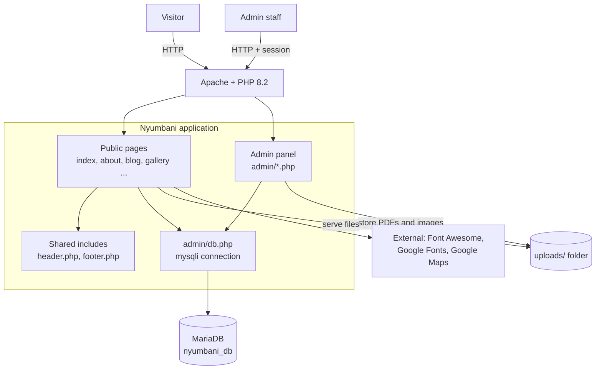
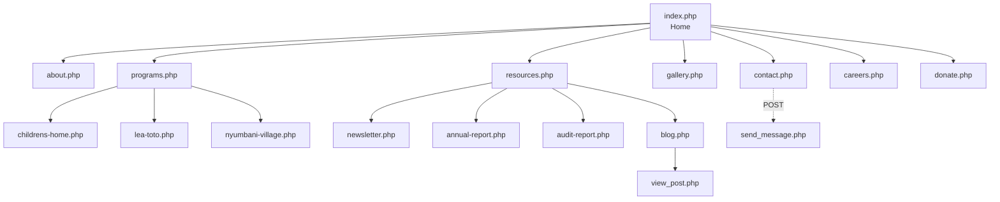
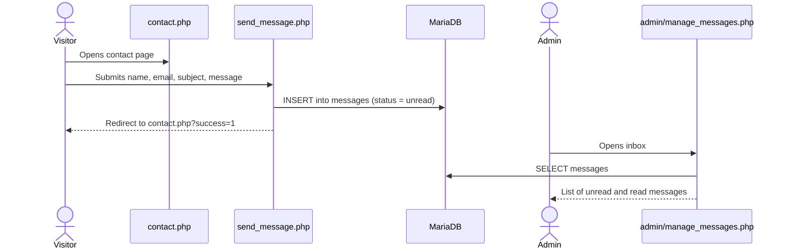
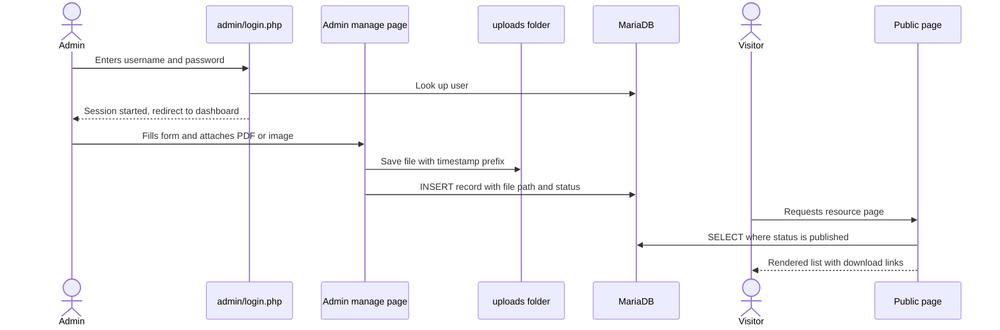
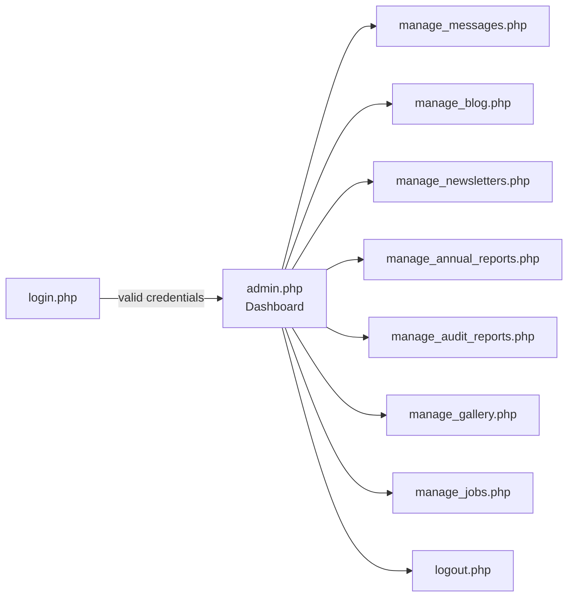

# Nyumbani Website Rebuild

A PHP and MySQL website for **Nyumbani Children's Home and the Children of God Relief Institute (COGRI)** in Kenya. It presents the organisation's programmes to the public, accepts messages and donations enquiries, and includes an admin panel so staff can publish blog posts, reports, newsletters, gallery photos and job openings without touching code.


## Table of Contents

1. [Features](#features)
2. [Architecture](#architecture)
3. [Site Map](#site-map)
4. [Request Flow](#request-flow)
5. [Admin Panel](#admin-panel)
6. [Database Schema](#database-schema)
7. [Tech Stack](#tech-stack)
8. [Project Structure](#project-structure)
9. [Getting Started](#getting-started)
10. [Security](#security)
11. [Roadmap](#roadmap)
12. [Contributing](#contributing)

## Features

**Public site**

- Pages for the Children's Home, Lea Toto community programme, Nyumbani Village (Kitui) and an overview of all programmes
- Blog / news with individual post pages
- Resources hub: newsletters, annual reports and audit reports (PDF downloads)
- Photo gallery managed from the database
- Careers page with categorised job openings (medical, social, admin)
- Contact form that stores messages in the database
- Donation page with M-Pesa and bank transfer details
- Shared header and footer for consistent navigation

**Admin panel** (`/admin`)

- Session-based login
- Dashboard with counts of newsletters, reports and jobs
- Create, edit, publish or delete blog posts, newsletters, annual reports and audit reports (draft / published workflow)
- Upload and delete gallery photos
- Manage job openings
- Inbox for contact-form messages (unread / read)

## Architecture

A classic server-rendered PHP application. Each page is a PHP script that includes a shared header and footer, queries MariaDB through `mysqli`, and returns HTML. Uploaded files live on disk, and their paths are stored in the database.



## Site Map



## Request Flow

### Contact form



### Publishing content



## Admin Panel



## Database Schema

Database name: `nyumbani_db`. The tables are independent (no foreign keys), and each content table has a `status` column so drafts stay hidden from the public site.

```mermaid
erDiagram
    users {
        int id PK
        varchar username
        varchar password
    }
    blog_posts {
        int id PK
        varchar title
        text content
        varchar image_path
        varchar author
        enum status "draft or published"
        timestamp created_at
    }
    newsletters {
        int id PK
        varchar title
        text description
        date publish_date
        varchar pdf_path
        varchar thumbnail_path
        enum status "draft or published"
    }
    annual_reports {
        int id PK
        varchar title
        int report_year
        text description
        varchar pdf_path
        enum status "draft or published"
    }
    audit_reports {
        int id PK
        varchar title
        int report_year
        text description
        varchar pdf_path
        enum status "draft or published"
    }
    gallery {
        int id PK
        varchar caption
        varchar image_path
        timestamp upload_date
    }
    job_openings {
        int id PK
        varchar title
        varchar location
        varchar job_type
        enum category "medical, social, admin"
    }
    messages {
        int id PK
        varchar name
        varchar email
        varchar subject
        text message
        enum status "unread or read"
        timestamp created_at
    }
```



## Tech Stack

| Layer | Technology |
|-------|------------|
| Backend | PHP 8.2, `mysqli` |
| Database | MariaDB 10.4 (MySQL compatible) |
| Frontend | HTML5, a single custom stylesheet (`css/style.css`) |
| Icons and fonts | Font Awesome (CDN), Google Fonts (Poppins) |
| Maps | Google Maps embed on the contact page |
| Local environment | XAMPP (Apache + MariaDB + phpMyAdmin) |

## Project Structure

```text
Nyumbani-website-rebuild/
├── index.php                 # Home page
├── about.php
├── programs.php              # Programmes overview
├── childrens-home.php
├── lea-toto.php
├── nyumbani-village.php
├── blog.php, view_post.php   # Blog list and single post
├── newsletter.php
├── annual-report.php
├── audit-report.php
├── resources.php             # Resources hub
├── gallery.php
├── careers.php
├── contact.php, send_message.php
├── donate.php
├── header.php, footer.php    # Shared layout
├── css/style.css
├── images/                   # Logos and static photos
├── uploads/                  # Admin-uploaded files (.htaccess blocks script execution)
├── admin/
│   ├── db.php                # Database connection (reads config.local.php if present)
│   ├── config.example.php    # Template for production DB credentials
│   ├── helpers.php           # Escaping, CSRF tokens, safe file uploads
│   ├── login.php, login_process.php, logout.php
│   ├── admin.php             # Dashboard
│   ├── manage_*.php          # Content management screens
│   └── blog_handler.php, gallery_handler.php, delete_photo.php
└── database/
    └── nyumbani_db.sql       # Schema and starter data
```

## Getting Started

### Prerequisites

- [XAMPP](https://www.apachefriends.org/) (or any Apache + PHP 8.x + MariaDB/MySQL stack)
- Git

### Installation

1. **Clone the repository into your web root** (`htdocs` for XAMPP):

   ```bash
   cd C:\xampp\htdocs
   git clone https://github.com/kinuthia-mark/Nyumbani-website-rebuild.git
   ```

2. **Create the database.** Start Apache and MySQL in XAMPP, open phpMyAdmin, create an empty database named `nyumbani_db` (collation `utf8mb4_general_ci`), then import `database/nyumbani_db.sql` into it.

3. **Check the connection settings.** The defaults in `admin/db.php` suit XAMPP (`root`, empty password, database `nyumbani_db`). For a live server, copy `admin/config.example.php` to `admin/config.local.php` and enter your real values; that file is git-ignored so your password is never uploaded.

4. **Open the site** at `http://localhost/Nyumbani-website-rebuild/` and the admin panel at `http://localhost/Nyumbani-website-rebuild/admin/login.php`.

5. **Sign in and change the starter password immediately.** The sample database has one admin account: username `admin`, password `ChangeMe123!`. Passwords are stored hashed. To set a new one, generate a hash:

   ```bash
   php -r "echo password_hash('your-new-password', PASSWORD_DEFAULT);"
   ```

   then run in phpMyAdmin: `UPDATE users SET password = '<paste hash>' WHERE username = 'admin';`
   (Plain-text passwords from older installs still work once and are converted to hashes automatically on first login.)

Upload folders are created automatically on first upload. On Linux hosting, make sure `uploads/` is writable by the web server.

## Security

| Area | How it is handled |
|------|-------------------|
| Passwords | Hashed with `password_hash()` and checked with `password_verify()`; legacy plain-text passwords are upgraded on first login |
| Sessions | Session ID regenerated on login, cookie is `HttpOnly` and `SameSite=Lax`, logout clears the session |
| SQL injection | Prepared statements for login, contact form and every insert; status and category fields are whitelisted |
| XSS | Visitor and admin content is escaped with `htmlspecialchars()` before display (`e()` helper in the admin area) |
| File uploads | Extension whitelist, real MIME type check, 10 MB limit, random file names; `uploads/.htaccess` blocks script execution |
| Access control | Every admin page and handler calls `require_admin()` |
| CSRF | Delete, publish and mark-as-read links carry a per-session token verified on the server |
| Secrets | Production DB credentials go in `admin/config.local.php`, which is git-ignored |
| Errors | Database errors are logged, not shown to visitors |

**Still recommended before a large public launch**

- Serve the site over HTTPS (then also enable `session.cookie_secure`)
- Use a dedicated MySQL user with limited rights instead of `root`
- Add stronger login attempt limiting (currently a 1-second delay on failure) and a password-reset flow if more staff are added
- Move admin write actions from links to POST forms
- Take regular backups of the database and the `uploads/` folder

## Roadmap

- [x] Public pages for programmes, resources, gallery, careers and donations
- [x] Admin panel with draft / publish workflow
- [x] Contact form with admin inbox
- [x] Security hardening (hashed passwords, prepared statements, safe uploads, CSRF tokens)
- [x] Remove duplicated code and the old `public --- copy` folder
- [ ] Add pagination to blog and resource lists
- [ ] Deployment guide for production hosting

## Contributing

1. Fork the repository
2. Create a branch: `git checkout -b feature/your-feature`
3. Commit your changes: `git commit -m "Describe your change"`
4. Push and open a Pull Request

## Author

**Mark Kinuthia** - [github.com/kinuthia-mark](https://github.com/kinuthia-mark)
